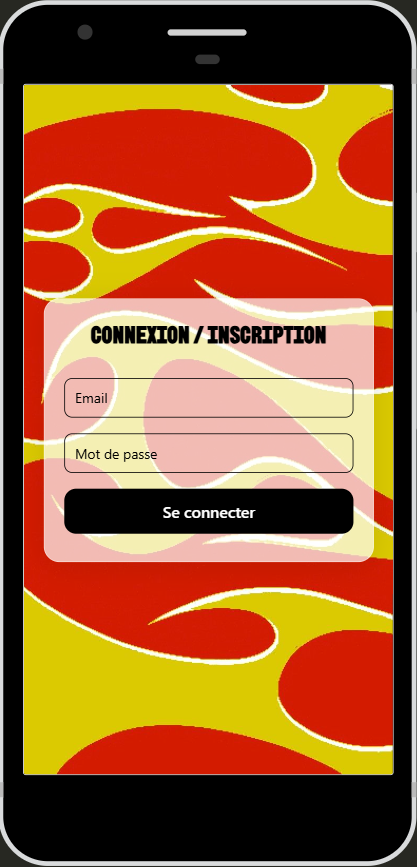
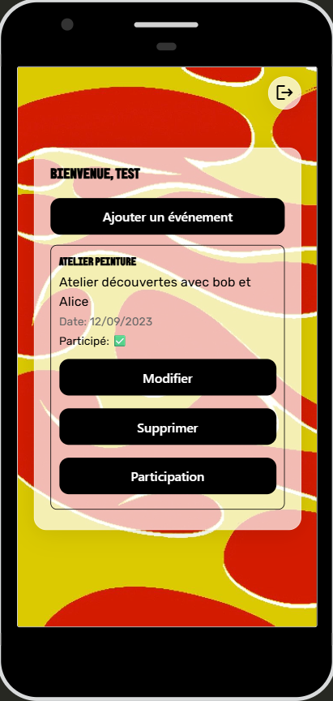
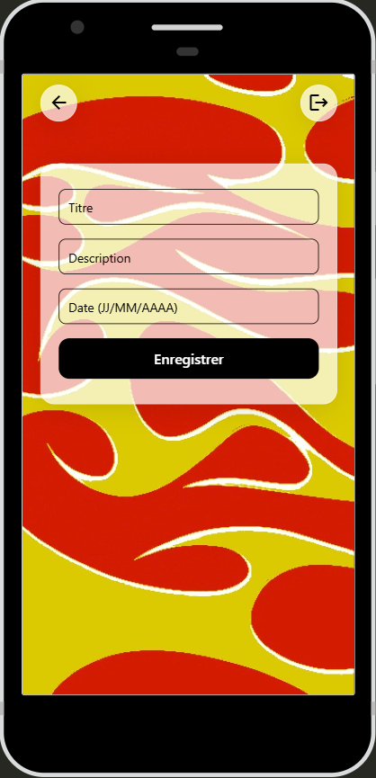

# EventEase

Une application mobile de gestion d'événements développée avec React Native et Expo. EventEase permet aux utilisateurs de créer, gérer et suivre leurs événements de manière simple et intuitive.

## 📱 Captures d'écran

<div align="center">
  
  
  
</div>

## ✨ Fonctionnalités

- **Authentification** : Système de connexion/inscription avec stockage local sécurisé
- **Gestion d'événements** : Créer, modifier et supprimer des événements
- **Suivi de participation** : Marquer les événements auxquels vous avez participé
- **Interface moderne** : Design glassmorphism avec fond d'image personnalisé
- **Multi-utilisateurs** : Chaque utilisateur a accès uniquement à ses propres événements
- **Navigation intuitive** : Boutons de retour et déconnexion accessibles

## 🚀 Technologies principales

- **React Native** (0.81.4) - Framework de développement mobile
- **Expo** (~54.0.13) - Plateforme de développement et déploiement
- **TypeScript** (~5.9.2) - Typage statique
- **React Navigation** (7.x) - Navigation entre écrans
- **AsyncStorage** (2.2.0) - Stockage local des données
- **Expo Router** (~6.0.11) - Gestion des routes
- **Expo Font** (~14.0.9) - Chargement de polices personnalisées
- **@expo/vector-icons** (^15.0.2) - Icônes Material Icons
- **UUID** (^13.0.0) - Génération d'identifiants uniques

## 📋 Prérequis

- Node.js (version 18 ou supérieure)
- npm ou yarn
- Expo CLI
- Un émulateur Android/iOS ou l'application Expo Go sur votre téléphone

## 🛠️ Installation

1. Clonez le repository :
```bash
git clone <url-du-repo>
cd EventEase
```

2. Installez les dépendances :
```bash
npm install
```

3. Lancez le projet :
```bash
npm start
```

## 📱 Lancement sur différentes plateformes

### Web
```bash
npm run web
```

### Android
```bash
npm run android
```

### iOS
```bash
npm run ios
```

### Avec Expo Go
1. Lancez `npm start`
2. Scannez le QR code avec l'application Expo Go sur votre téléphone

## 🏗️ Structure du projet

```
EventEase/
├── app/                          # Écrans et navigation
│   ├── index.tsx                 # Point d'entrée principal
│   └── _layout.tsx               # Configuration de la navigation
├── src/
│   ├── components/               # Composants réutilisables
│   │   ├── BackButton.tsx
│   │   ├── BackgroundWrapper.tsx
│   │   ├── Card.tsx
│   │   ├── CustomButton.tsx
│   │   ├── IconButton.tsx
│   │   ├── LogoutButton.tsx
│   │   └── styles/               # Styles des composants
│   ├── controllers/              # Logique métier
│   │   ├── AuthController.ts
│   │   └── EventController.ts
│   ├── models/                   # Modèles de données
│   │   ├── UserModel.ts
│   │   └── EventModel.ts
│   ├── pages/                    # Écrans de l'application
│   │   ├── LoginScreen.tsx
│   │   ├── HomeScreen.tsx
│   │   ├── EventFormScreen.tsx
│   │   └── styles/               # Styles des pages
│   ├── services/                 # Services
│   │   └── storage.ts            # Gestion AsyncStorage
│   ├── styles/                   # Styles globaux
│   │   └── typography.ts
│   ├── types/                    # Définitions TypeScript
│   │   ├── User.ts
│   │   └── Event.ts
│   └── hooks/                    # Hooks personnalisés
│       └── useFonts.ts
├── assets/                       # Ressources
│   ├── fonts/                    # Polices personnalisées
│   └── images/                   # Images et icônes
└── package.json
```

## 🎨 Design

L'application utilise un design moderne avec :
- **Glassmorphism** : Effet de verre dépoli pour les cartes
- **Polices personnalisées** : BBH Sans Bogle pour les titres, Rubik pour le corps
- **Background animé** : Image de fond colorée sur tous les écrans
- **Icônes Material** : Boutons de navigation et actions

## 💾 Stockage des données

Les données sont stockées localement sur l'appareil via AsyncStorage :
- **Utilisateurs** : Stockés sous la clé `users`
- **Événements** : Stockés sous la clé `events`
- **Utilisateur actuel** : Stocké sous la clé `currentUser`

## 🔐 Sécurité

- Isolation des données par utilisateur
- Validation des champs de formulaire
- Mot de passe minimum 4 caractères
- Chaque événement est lié à un email utilisateur

## 📝 Utilisation

1. **Connexion/Inscription** : Entrez un email et un mot de passe
2. **Page d'accueil** : Visualisez tous vos événements
3. **Ajouter un événement** : Cliquez sur "Ajouter un événement" et remplissez le formulaire
4. **Modifier un événement** : Cliquez sur "Modifier" sur un événement existant
5. **Marquer la participation** : Cliquez sur "Participation" pour indiquer que vous avez participé
6. **Supprimer un événement** : Cliquez sur "Supprimer"
7. **Déconnexion** : Cliquez sur l'icône de déconnexion en haut à droite

